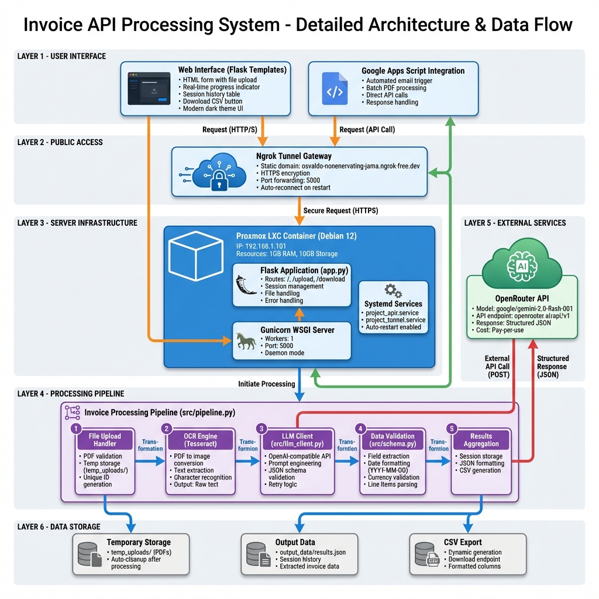
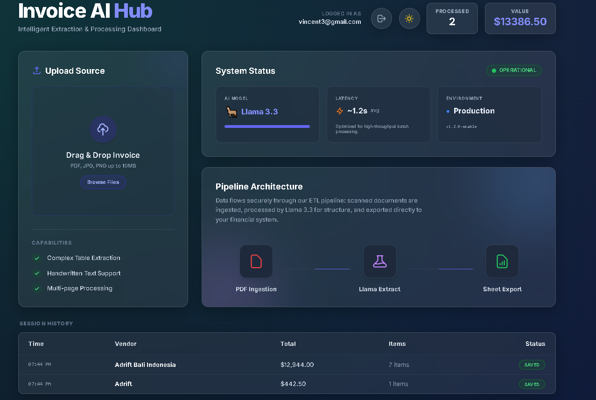
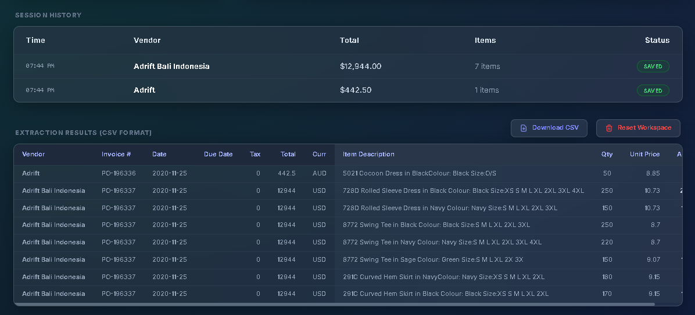

<h1 align="center">Invoice AI Hub</h1>

<p align="center">
  A Self-Hosted Invoice Processing System harnessing Gemini 2.0 Flash for intelligence and a modern Vue.js frontend.
</p>

<p align="center">
  
  
  
  
</p>

---

*   If you find this tool useful for automating your finance workflows, please consider giving it a star!

**Invoice AI Hub** is a powerful, self-hosted ETL pipeline designed to run on a home lab (Proxmox). It ingests unstructured invoice data (PDFs/Images), extracts structured financial information using the latest Generative AI models (Gemini 2.0 Flash), and provides a polished Dashboard for review and export.

The project uses a **Microservices Architecture**, separating the UI (Frontend LXC) from the Intelligence (Backend API LXC), secured behind Cloudflare Tunnels.

---

## System Architecture

The following diagram illustrates the complete system architecture and data flow:



**Key Components:**
- **Frontend Service**: Nginx container serving a modern Vue.js/Alpine.js Single Page Application (SPA).
- **Backend Service**: Dedicated LXC container running a Python Flask API.
- **Intelligence Engine**: Utilizes an OpenAI-compatible client to interface with LLMs (Gemini/GPT-4o).
- **Public Gateway**: Cloudflare Zero Trust Tunnels for secure external access without port forwarding.
- **Data Persistence**: Local SQLite database for user management and invoice history.

---

## User Interface

The application features a modern, responsive dark-themed interface.

### Upload & Processing Dashboard
Manage file uploads and view real-time processing status.


### Extraction Results & Export
Review extracted data in a structured table and export to CSV.


---

## Features

*   **Self-Hosted & Private**: Runs entirely on your own infrastructure (Proxmox/Docker).
*   **Modern UI**: Beautiful, responsive dashboard built with TailwindCSS and Alpine.js.
*   **Intelligent Extraction**: Uses Gemini 2.0 Flash to parse complex tables and handwriting.
*   **Multi-User System**: Built-in Sign Up/Login system with secure session management.
*   **Data Sovereignty**: All processed data is stored in your local SQLite database, not the cloud.
*   **Microservices Ready**: Decoupled frontend/backend allows purely API-driven usage if needed.

## Requirements

*   Python 3.10+
*   Cloudflare Tunnel (for exposing local API)
*   Ollama (Local LLM) or OpenAI API Key

## Installation

Clone the repository:

```bash
git clone https://github.com/yourusername/Project_APIR.git
cd Project_APIR
```

Install dependencies:

```bash
pip install -r requirements.txt
```

## Configuration

1.  **Environment Variables**: Create a `.env` file in the root directory:
    ```ini
    OPENAI_API_KEY=sk-...  # Optional if using Local LLM
    FLASK_ENV=development
    ```

2.  **Start Backend**:
    ```bash
    python app.py
    ```

3.  **Cloudflare Tunnel**:
    The API is permanently exposed via Cloudflare Tunnel at:
    `https://invoice-api.huwanbisente.online`

    *(No manual tunnel startup required)*

## Project Structure

```text
├── app.py                  # Main Flask API Application
├── add_user.py             # CLI Tool for managing users
├── src/
│   ├── database.py         # SQLite Database Manager
│   ├── pipeline.py         # Main AI Extraction Logic
│   ├── llm_client.py       
